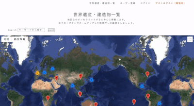

# README

# 地球押し（CHIKYU-OSHI）
これはGoogleMapを使ってクイズの練習をするアプリです。  
自分の好きな世界遺産や建造物や場所を登録し、地図をズームアップして上空から確認する、とてもシンプルなアプリです。

クイズ番組「東大王」では、世界地図を上空からズームアップしていき、答えがわかった時点で早押しで対象の世界遺産や建造物の名称を回答するというクイズがあります。  

ほとんどズームアップしない状態で解答することを「地球押し」と言うのですが、東大王メンバーよりも早く「わかった！」となりたいという思いがあり、このアプリを開発しました。

# 概要
- GoogleMapを利用したアプリです。
- 名称で検索してヒットすると緯度・経度が自動取得され、地図にピンがセットされます。
- もちろん世界遺産だけでなく、「東京駅」などの地名を入力してもヒットします。
- 日本語以外の言語で名称を入力してもOK。
- 上空からの画像を見るもよし、ストリートビューを見るもよしです。

# デモ
### URL
http://54.168.157.246/  

ゲストログイン（閲覧用）をクリックすると簡単にログインできます。  
（※ゲストログイン用のアカウントは編集・削除不可です）  
終了時には必ずログアウトをお願いします。  

### デモ画面
トップ画面〜一覧画面（ログインしなくても見れます）  

一覧画面〜詳細画面（ログインしなくても見れます）  

スマートフォン画面のデモです  
</a>

# 使用技術（開発環境）
- Ruby 2.6.5
- Ruby on Rails 6.0.3.2
- JavaScript
- jQuery
- Haml
- Scss 
- MySQL 14.14
- GitHub
- AWS(EC2,S3)
- VSCode

# 注意事項
- 世界遺産や地名など、検索時にヒットしない場合があります。緯度・経度が取得されない状態で表示されますので、editボタンから名称を編集をしてみてください。
- Wikipediaに記載されている名称を英語や母国語で入力すると、ヒットする可能性が上がります。
- 名称でヒットしなかった場合、緯度・経度は編集可能です。

# 今後の課題（実装したい機能）
- ransackを用いた検索機能
- ページネーション
- タグ付け

# DB設計
## usersテーブル
| Column             | Type   | Options     |
| ------------------ | ------ | ----------- |
| nickname           | string | null: false, unique: true|
| email              | string | null: false |
| text               | string |             |
| image              | string |             |
| header_image       | string |             |
| encrypted_password | string | null: false |
### Association
- has_many :posts
- has_many :likes, dependent: :destroy
- has_many :like_posts, through: :likes, source: :post
## postsテーブル
| Column                  | Type    | Options                        |
| ----------------------- | ------- | ------------------------------ |
| name                    | string  | unique: true                   |
| description             | string  |                                |
| latitude                | float   |                                |
| longitude               | float   |                                |
| country_id(active_hash) | integer |                                |
| user_id                 | string  | null: false, foreign_key: true |
| likes_count             | integer |                                |
### Association
- has_many :likes, dependent: :destroy
- has_many :liking_users, through: :likes, source: :user
- belongs_to :user
- belongs_to_active_hash :country
## likesテーブル
| Column  | Type    | Options |
| ------- | ------- | ------- |
| user_id | integer |         |
| post_id | integer |         |
### Association
- belongs_to :post, counter_cache: :likes_count
- belongs_to :user

<!-- Things you may want to cover:

* Ruby version

* System dependencies

* Configuration

* Database creation

* Database initialization

* How to run the test suite

* Services (job queues, cache servers, search engines, etc.)

* Deployment instructions

* ... -->
